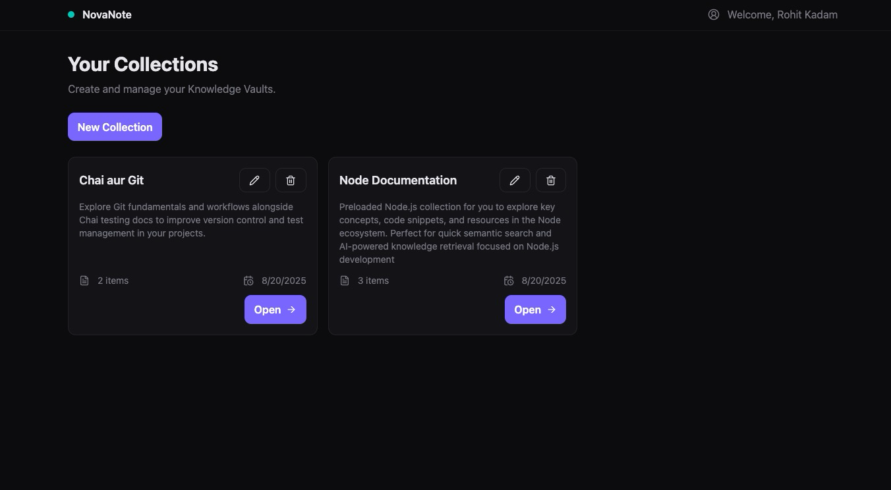
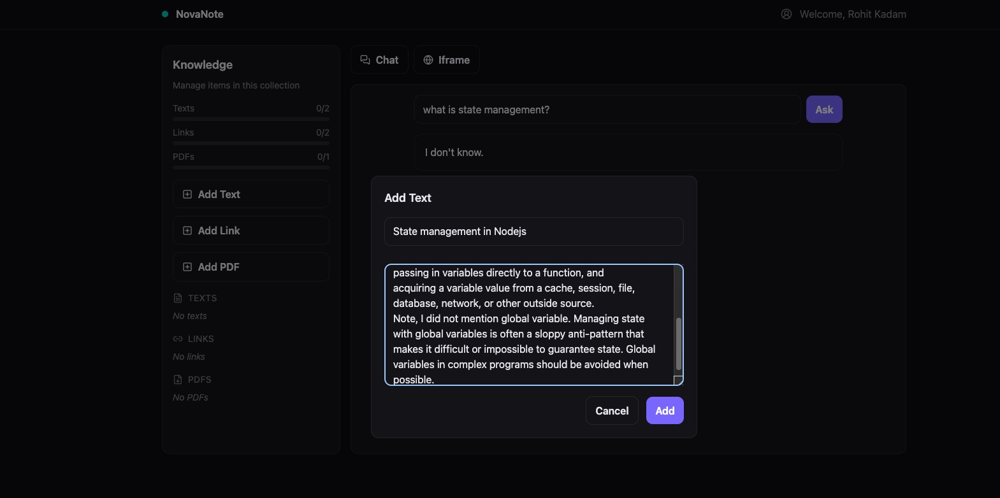
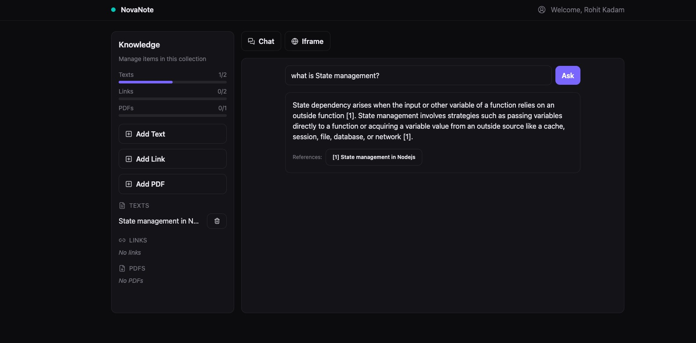
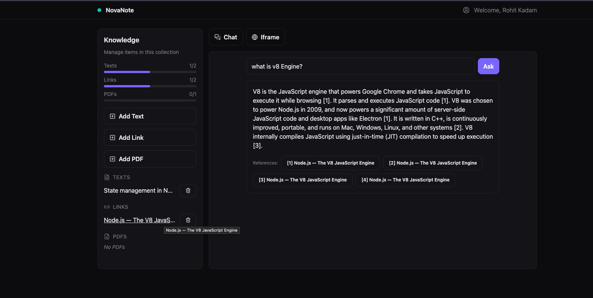
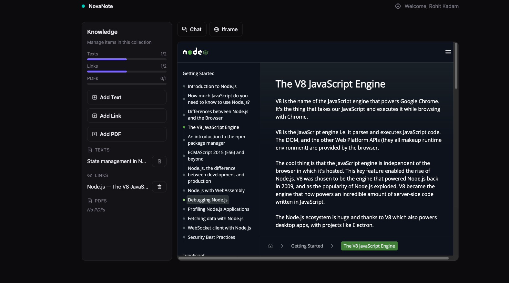
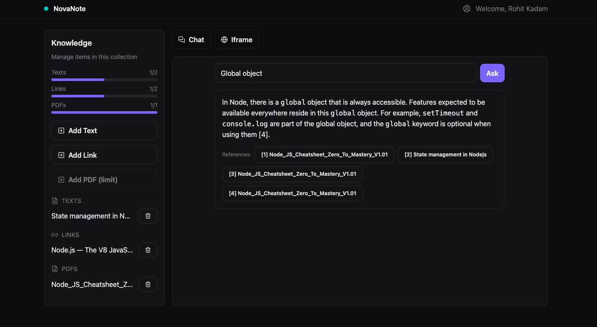

# NovaNote - AI-Powered Knowledge Notebook (POC)

NovaNote is a simplified AI-powered knowledge management system inspired by NotebookLM. This project serves as a proof-of-concept (POC) for educational purposes, demonstrating a modern full-stack app with AI integration, vector search, and knowledge organization.

---

## Features

- **User Identification:** Username-based cookie sessions, no login required  
- **Collections ("Knowledge Vaults"):**  
  - Create, update, delete collections  
  - Limit 2 collections for free users, unlimited for Pro/admin  
- **Knowledge Items:** Texts, Links, PDFs per collection  
  - Free tier limits: 2 texts, 2 links, 1 PDF per collection  
  - Upload PDFs (client-side parsing)  
  - Link crawling and content extraction (server-side)  
  - Text entries with automatic vector embedding and indexing  
- **AI Chat:**  
  - Contextual Q&A powered by OpenAI + Qdrant vector search  
  - Answers cite sources with clickable references  
- **Workspace UI:**  
  - Sidebar with usage indicators and item management  
  - Chat and iframe tabs with seamless mapping  
- **Tech Stack:** Next.js 15, TypeScript, TailwindCSS v4 (CSS-first), Drizzle ORM + Neon DB, Zustand, TanStack Query, LangChain, Qdrant, OpenAI API  
- **Free and Pro tiers:** Enforced usage limits with upgrade path planned  

---

## Getting Started

### Prerequisites
- Node.js 18 or newer  
- pnpm or npm  
- Neon account for Postgres DB  
- Qdrant Cloud account  
- OpenAI API key  

### Environment Variables

Create a `.env.local` file in the root with:

```
DATABASE_URL=postgresql://<user>:<password>@<host>/<db>?sslmode=require
QDRANT_URL=https://<your-qdrant-cluster-url>
QDRANT_API_KEY=<your-qdrant-api-key>
OPENAI_API_KEY=<your-openai-api-key>
API_KEY=
MODEL=
BASE_URL=
```

---

### Installation & Setup

1. Clone the repository  
2. Install dependencies:
   ```
   pnpm install
   ```
3. Push Drizzle schema to Neon:
   ```
   pnpm db:push
   ```
4. Run development server:
   ```
   pnpm dev
   ```
5. Open [http://localhost:3000](http://localhost:3000) in browser  

---

### Usage

- On first visit, enter a username (stored in cookie).  
- Create up to 2 collections (free tier).  
- Inside a collection, add text notes, PDFs, or links.  
- Use the chat tab to ask questions about your collection’s knowledge.  
- Click references in answers to view original sources in iframe tab.  

---

### Project Structure Highlights

```
/app                      # Next.js app routes and pages
/components               # React components (ChatPanel, Modals, Header, etc.)
/db                       # Drizzle ORM schema and client setup
/lib                      # Backend helpers (chunking, embedding, Qdrant integration, scraping)
/store                    # Zustand UI state management
/hooks                    # TanStack Query data hooks
```

---

### Screenshots












---
### Important Notes

- No files are persisted; PDFs are parsed client-side.  
- Crawls run server-side with server fetching + readability extraction.  
- AI chat uses OpenAI GPT models; costs depend on your usage.  
- Usage limits are strictly enforced on both client and server.  
- Designed for educational/demo use — not production hardened.  

---

### Contact

Educational project by [chaicode.com](http://chaicode.com/)  
